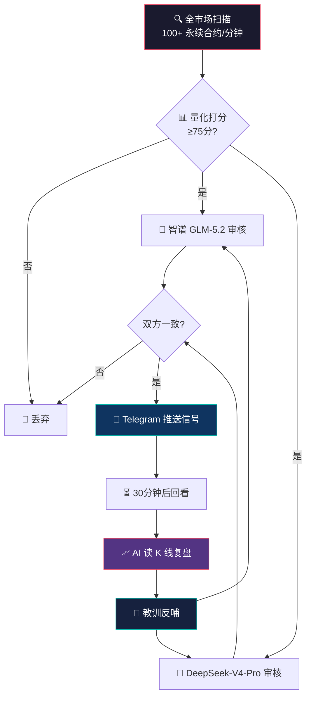
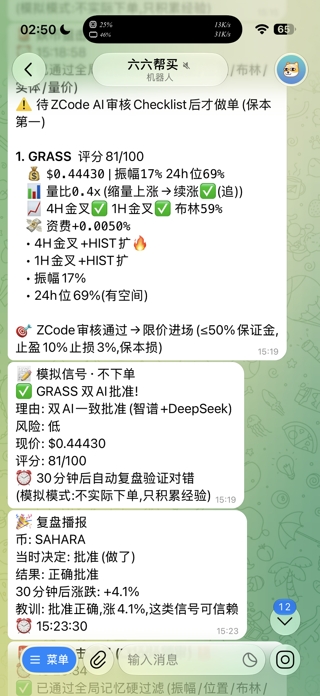
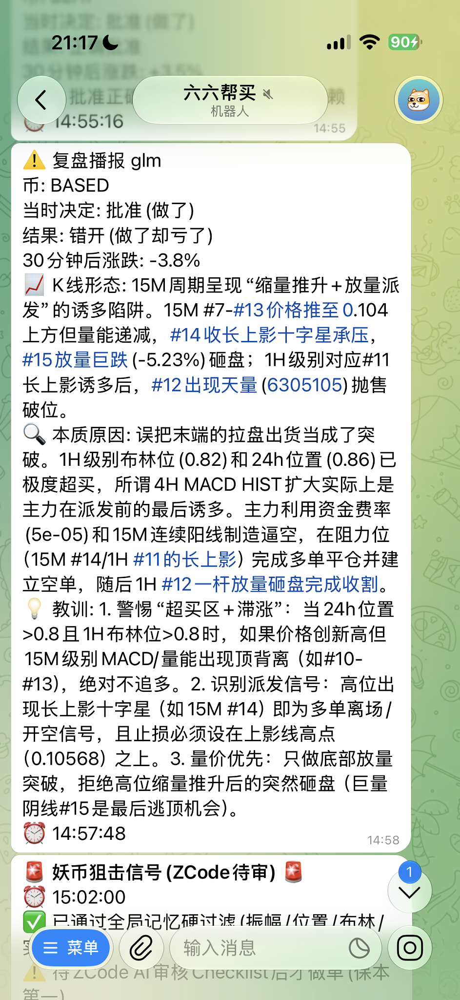
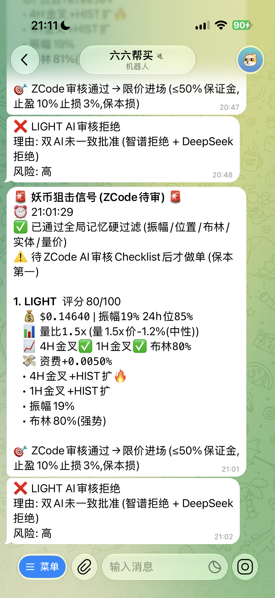

# 🚀 妖币狙击 · 双AI驱动的实时信号系统

> **Dual-AI Meme Coin Sniper** — 一套 7×24 全自动的妖币发现引擎。
> 每分钟扫描全市场 100+ 币种，由**两个顶级 AI 交叉审核**，双方一致看好才推送。
> 不靠感觉，只靠数据——让 AI 替你盯盘、判断、复盘。

<p align="center">
  <a href="https://t.me/cysoocoinbot">
    
  </a>
</p>

<p align="center">
  <strong>👉 点击上方蓝色按钮，或搜索 <code>@cysoocoinbot</code> 立即加入</strong><br>
  <a href="https://t.me/cysoocoinbot">https://t.me/cysoocoinbot</a>
</p>

<p align="center">
  <strong>🤖 GLM-5.2 × DeepSeek-V4-Pro · 双模型交叉审核 · 零盲点信号</strong>
</p>

---

## 📖 目录

- [🚀 立即加入](#-立即加入)
- [🔥 这是什么](#-这是什么)
- [🧠 核心能力](#-核心能力)
- [🏗️ 系统架构](#️-系统架构)
- [📡 工作流程](#-工作流程)
- [📸 真实信号示例](#-真实信号示例)
- [🛡️ 风控与自我进化](#️-风控与自我进化)
- [⚠️ 风险提示](#️-风险提示)
- [🔓 获取访问权限](#-获取访问权限)

---

## 🚀 立即加入

<p align="center">
<a href="https://t.me/cysoocoinbot"></a>
</p>

> 📲 **三步开始接收妖币信号：**
> 1. 在 Telegram 搜索 **`@cysoocoinbot`** 或点击 [t.me/cysoocoinbot](https://t.me/cysoocoinbot)
> 2. 点 **开始** — 系统会引导你完成开通
> 3. 开通后，双 AI 筛选的妖币信号实时推送到你的 Telegram

**找不到？直接复制这个链接到浏览器：**
```
https://t.me/cysoocoinbot
```

---

## 🔥 这是什么

加密货币市场从来不缺机会，缺的是**在机会出现的第一秒就发现它、并看懂它**。

人类盯盘会累、会漏、会情绪化。这个系统把这件事彻底交给 AI：

| 人类做不到 | 系统做到 |
|:---:|:---:|
| 7×24 盯 100+ 个币 | ✅ 每分钟全自动全景扫描 |
| 同时分析几十个指标 | ✅ 量化多维度打分 |
| 克服恐惧与贪婪 | ✅ 只认数据，没有情绪 |
| 复盘每一笔对错 | ✅ AI 逐根读 K 线，总结本质原因 |

**核心信念：信号不是靠运气，是靠把每一个 K 线背后的主力意图读出来。**

---

## 🧠 核心能力

### 🤖 双 AI 交叉审核（误报率极低）

市面上大多数信号源只有一个判断。这个系统用**两个独立的大模型并行审核**，只有**双方都批准**才推送：

- **智谱 GLM-5.2** — 国产顶级大模型，擅长中文语境与逻辑推理
- **DeepSeek-V4-Pro** — 推理能力极强的通用大模型

两个 AI 看到的是同一份信号数据，却独立给出判断。**任一方拒绝，信号就不推送。** 这种交叉验证大幅过滤了单一模型的误判——你要的不是一个"可能涨"，而是"两个顶级大脑都说可以"。

```
信号候选
  ├── GLM-5.2 审核 ──→ ✅ 批准
  ├── DeepSeek 审核 ──→ ✅ 批准
  └── 双方一致 ────────→ 📢 推送给你

  若任一方拒绝 ──────→ 🚫 静默丢弃（你看不到噪音）
```

### 📊 100 币/轮全景扫描 · 75 分严门槛

每一轮扫描覆盖全市场 100+ 永续合约，从价格、量能、资金费、持仓、技术指标五个维度量化打分：

- **MACD 多周期金叉**（4H + 1H）
- **量价关系**（量比、缩量/放量、买卖盘）
- **布林带位置**（是否突破在即）
- **资金费率**（做空/做多拥挤度，识别逼空潜力）
- **24h 振幅与位置**（真正的妖币特征）

只有**综合评分 ≥ 75 分**的信号才有资格进入双 AI 审核。这意味着你收到的每一条信号，都是经过**量化筛选 + 双 AI 把关**两道关卡的。

### 📈 AI 深度读 K 线复盘（这才是核心）

绝大多数信号系统发出信号就结束了。**这个系统不一样——每一条信号 30 分钟后都会自动回看，并由 AI 逐根分析 K 线，给出本质归因。**

复盘不只是看"涨没涨"，而是回答：

> **这一根 K 线背后，主力在做什么？**

AI 会分析：
- 🔍 **K 线形态**：连阳突破？缩量阴跌？插针洗盘？平台震荡？
- 🎯 **主力意图**：吸筹？派发出货？逼空？诱多诱空？
- 💡 **本质原因**：为什么这笔对了 / 错了？当时哪些特征被误判了？
- 📐 **可操作教训**：下次遇到相似特征，具体应该怎么做？

```
📡 信号推送 ──→ 30分钟后 ──→ AI 读 K 线深度复盘

  📈 K线形态: 决策后连4阳缩量企稳,第3根放量突破前高
  🔍 本质原因: 庄家缩量吸筹完毕,做空拥挤触发逼空
               HIST缩小是启动前的最后洗盘,而非趋势反转
  💡 教训: 低位+做空付费+缩量+HIST缩小=吸筹尾声,应果断进场
```

### 🧠 自我迭代学习（越用越准）

这是让系统真正"进化"的机制。每一次复盘产生的教训——**漏单**（本该抓却错过）和**错单**（做了却亏）——都会自动反哺到 AI 的下一次审核中：

- 漏单教训会被标记为**最高优先级**，AI 下次遇到相似特征会更积极
- 错单教训让 AI 在危险信号前更谨慎
- 判断与实战结果**持续对齐**，而不是一成不变的死规则

> 系统不会重复犯同一个错误。每一次漏单，都是下一次不再漏的理由。

### ⚡ 全程实时播报

所有信号、复盘、平仓事件都通过 Telegram 实时推送，到手即用：

| 推送类型 | 内容 |
|---|---|
| 📡 信号播报 | 双 AI 批准的进场信号（币种/价格/评分/理由） |
| 📚 复盘播报 | 30 分钟后 K 线形态 + 本质原因 + 教训 |
| 🎉 开仓/平仓 | 入场、止盈、止损全程通知 |

---

## 🏗️ 系统架构



---

## 📡 工作流程

**一条信号从产生到送达你手上，要闯过 4 道关卡：**

1. **🔍 全景扫描** — 每分钟扫 100+ 币种，提取价格/量能/资金费/持仓/技术指标
2. **📊 量化过滤** — 五维度打分，≥75 分才进入下一关（绝大多数信号死在这里）
3. **🤖 双 AI 审核** — GLM-5.2 和 DeepSeek 各自独立判断，都批准才放行
4. **📢 推送 + 复盘** — 信号送达你，30 分钟后 AI 自动读 K 线复盘对错

**每一道关卡都在替你过滤噪音。你最终看到的，是百里挑一、双脑认可的信号。**

---

## 📸 真实信号示例

> 以下是系统运行中**真实产生**的信号与复盘播报，未经任何修饰。

<table>
  <tr>
    <td width="50%" align="center"><b>📡 双 AI 批准的进场信号</b></td>
    <td width="50%" align="center"><b>📈 AI 深度复盘（K线形态 + 本质原因）</b></td>
  </tr>
  <tr>
    <td width="50%" align="center"></td>
    <td width="50%" align="center"></td>
  </tr>
</table>

<p align="center">
  <b>🧠 错单复盘 — AI 逐根分析 K 线，揪出诱多陷阱</b><br>
  
</p>

<details>
<summary>📖 看看 AI 复盘都分析些什么（点击展开）</summary>

每一条信号推送 30 分钟后，AI 会自动回看真实 K 线，逐根分析并输出：

- **📈 K 线形态**：连阳突破？缩量阴跌？插针洗盘？引用具体 K 线根数说明
- **🔍 本质原因**：主力在吸筹 / 出货 / 逼空 / 诱多？基于量价关系得出结论
- **💡 可操作教训**：下次遇到相似特征，具体应该怎么做

AI 不只说"涨了"或"跌了"，而是**读出每一根 K 线背后的主力意图**。
</details>

---

## 🛡️ 风控与自我进化

系统内置多重保护机制，确保稳健运行：

- **保本损机制** — 浮盈达 0.5% 自动升级止损至入场价，锁定不亏
- **硬止损兜底** — 独立于 AI 的 -3.5% 硬止损，极端行情最后一道防线
- **断路器** — API 异常时自动熔断，避免在数据缺失时盲目下单
- **单例锁 + 状态持久化** — 进程崩溃自动重启，状态不丢失
- **冷却机制** — 刚平仓的币 2 小时内不重开，避免反复打脸

---

## ⚠️ 风险提示

> 这个系统是**工具，不是印钞机**。

- 📉 加密货币市场波动剧烈，**任何信号都不能保证盈利**，历史表现不代表未来
- 🤖 AI 审核大幅降低误报，但**无法消除市场风险**，仍可能亏损
- 💰 请只用**你能承受损失的资金**参与，切勿借贷或投入生活必需资金
- 🧠 系统提供的是**经过双重过滤的信号和深度分析**，最终决策权在你手中
- ⚖️ 本项目不构成任何投资建议，仅供技术展示与学习交流

**理性使用，长期主义。信号的价值在于提高胜率，而非消除风险。**

---

## 🔓 获取访问权限

本系统为**付费授权制**，开通后即可接收实时妖币信号播报。

### 💎 开通方式

1. 在 Telegram 加入机器人 **[@cysoocoinbot](https://t.me/cysoocoinbot)** 并点 **开始**
2. 向以下地址转入 **30 USDT (ERC-20)**：

   ```
   0x56240b2c3f9d0fe8fb5227bab0e4cd8290e3d10a
   ```

3. **截图保存转账记录**
4. 联系管理员 **[@misaka_c](https://t.me/misaka_c)**
5. 发送 **转账截图 + 你的 Telegram 账号**（用户名，非手机号）
6. 管理员核验后立即开通 ✅

### 开通后你将获得

- 📡 双 AI 交叉审核的实时妖币信号播报（推送到 **@cysoocoinbot**）
- 📈 每条信号 30 分钟后的 AI 深度 K 线复盘
- 🧠 系统自我迭代，信号质量持续提升
- ⚡ 全程 Telegram 推送，到手即用

<p align="center">
<a href="https://t.me/cysoocoinbot"></a>
</p>

---

<div align="center">

**🚀 让 AI 替你看懂每一个 K 线背后的主力意图**

*Dual-AI Cross-Validation · 100-Coin Scanning · K-Line Post-Mortem · Self-Evolving*

**👉 机器人：[@cysoocoinbot](https://t.me/cysoocoinbot) · 管理员：[@misaka_c](https://t.me/misaka_c)**

</div>
